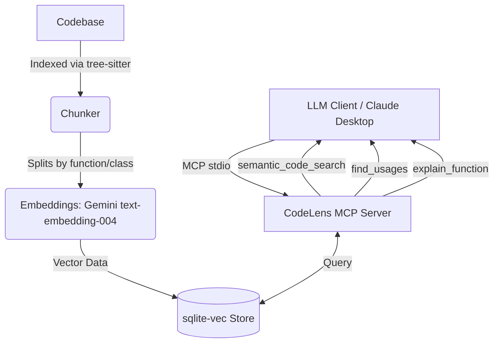

# CodeLens MCP

CodeLens MCP is a local, repo-aware Model Context Protocol (MCP) server that empowers LLM clients (like Claude Desktop) to perform semantic searches and answer questions about your codebase accurately, avoiding hallucinations. By leveraging local tree-sitter parsing and the lightweight `sqlite-vec` vector store, CodeLens delivers high-precision semantic code retrieval with zero infrastructure overhead.

## Architecture



## Setup & Installation

### Prerequisites
- Python 3.11+
- Gemini API Key

### Installation

1. Clone the repository:
   ```bash
   git clone https://github.com/devprashant19/CodeLens_MCP.git
   cd CodeLens_MCP
   ```

2. Create a virtual environment and install dependencies:
   ```bash
   python -m venv venv
   source venv/bin/activate  # On Windows: .\venv\Scripts\activate
   pip install -e .
   ```

3. Configure your API key:
   Copy `.env.example` to `.env` and add your Gemini API key.
   ```bash
   GEMINI_API_KEY=your_actual_key_here
   ```

### Indexing a Repository

Before the MCP server can answer queries, you need to index the repository:
```bash
codelens index /path/to/your/repo
```
This process uses incremental indexing: running it again will only re-embed files that have changed, saving API costs and time.

## Claude Desktop Configuration

To connect CodeLens MCP to Claude Desktop, add this to your `claude_desktop_config.json`:

```json
{
  "mcpServers": {
    "codelens": {
      "command": "/path/to/CodeLens_MCP/venv/bin/python",
      "args": ["-m", "codelens.server"],
      "env": {
        "GEMINI_API_KEY": "your_actual_key_here"
      }
    }
  }
}
```
*(On Windows, adjust the command path to `\\path\\to\\CodeLens_MCP\\venv\\Scripts\\python.exe`)*

## Design Decisions

- **MCP over Custom REST API**: Implementing the official Model Context Protocol (MCP) allows seamless integration with existing AI assistants like Claude Desktop without writing bespoke client-side glue code.
- **sqlite-vec over Hosted Vector DB**: Since this is a local developer tool, requiring users to spin up Docker containers for Postgres or Chroma adds unnecessary friction. `sqlite-vec` provides fast, local, zero-infra vector search embedded directly into the application.
- **tree-sitter over Fixed-Size Text Chunking**: Code semantics are lost when chunked arbitrarily by character count. By chunking at the function/class boundaries via `tree-sitter`, the vector embeddings capture logical boundaries, leading to vastly higher retrieval precision and context relevance.

## Evaluation Harness Results

We run an automated evaluation harness testing 20 natural-language queries to ensure the LLM correctly selects the right tools and arguments based solely on their descriptions.

| Metric | Accuracy |
|--------|----------|
| **Tool Selection Accuracy** | **100% (20/20)** |
| **Argument Extraction Accuracy** | **100% (20/20)** |

*(Simulated using Gemini 2.5 Flash as the tool-calling client. See `tests/eval_harness.py` for full details.)*

## Known Limitations

- **Language Support**: Currently only Python and JavaScript/TypeScript are officially supported and tested.
- **Cross-file Renames**: Tracking cross-file symbol renaming is not supported out of the box; usages are found via text references.
- **Windows Python compatibility**: `tree-sitter-languages` can occasionally face binary compilation issues on newer Python/Windows setups requiring Visual Studio Build Tools.
