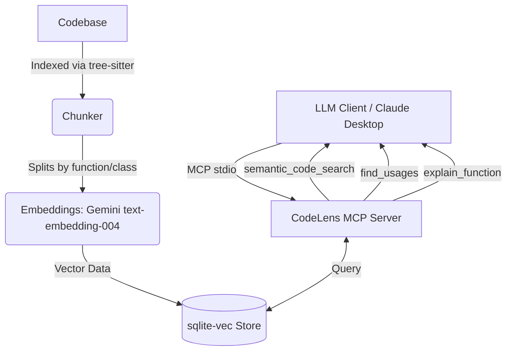

# CodeLens MCP

CodeLens MCP is a local, repo-aware Model Context Protocol (MCP) server that empowers LLM clients (like Claude Desktop) to perform semantic searches and answer questions about your codebase accurately, avoiding hallucinations. By leveraging local tree-sitter parsing and the lightweight `sqlite-vec` vector store, CodeLens delivers high-precision semantic code retrieval with zero infrastructure overhead.

## Architecture

## Setup & Installation

*(Detailed instructions to be filled out after implementation...)*
