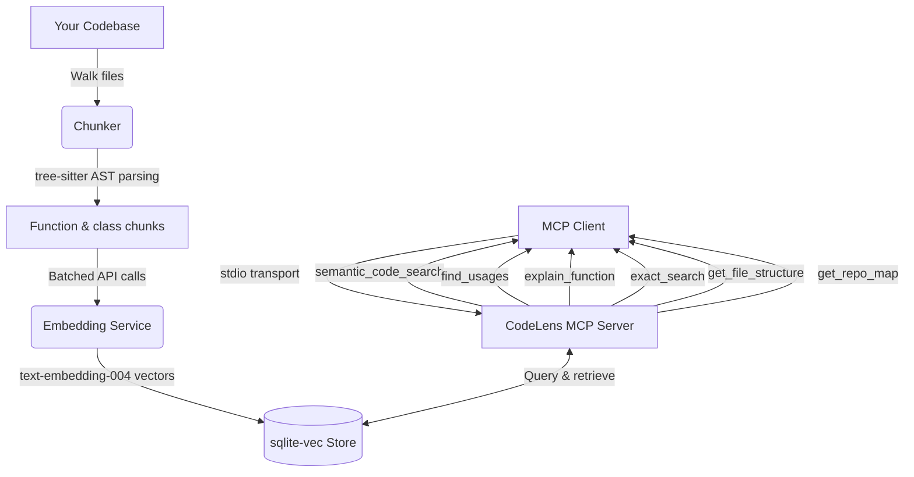

# CodeLens MCP

[](https://github.com/devprashant19/CodeLens_MCP/actions/workflows/ci.yml)
[](https://www.python.org/downloads/)
[](LICENSE)

**CodeLens MCP** is a local, repo-aware [Model Context Protocol](https://modelcontextprotocol.io/) (MCP) server that empowers any MCP client to perform semantic searches, navigate symbols, and answer deep questions about a codebase — without hallucinations. By combining tree-sitter AST parsing with the lightweight `sqlite-vec` vector store, CodeLens delivers high-precision semantic code retrieval with **zero infrastructure overhead**.

---

## Table of Contents

- [Architecture](#architecture)
- [Features](#features)
- [Setup & Installation](#setup--installation)
- [Indexing a Repository](#indexing-a-repository)
- [MCP Client Configuration](#mcp-client-configuration)
- [Docker Deployment](#docker-deployment)
- [Available MCP Tools](#available-mcp-tools)
- [Environment Variables](#environment-variables)
- [Project Structure](#project-structure)
- [Testing & Quality](#testing--quality)
- [Evaluation Harness](#evaluation-harness)
- [Design Decisions](#design-decisions)
- [Known Limitations](#known-limitations)
- [Contributing](#contributing)

---

## Architecture


```mermaid
graph TD
    A[Your Codebase] -->|Walk files| B(Chunker)
    B -->|tree-sitter AST parsing| C[Function & class chunks]
    C -->|Batched API calls| D(Embedding Service)
    D -->|text-embedding-004 vectors| E[(sqlite-vec Store)]

    F[MCP Client] -->|stdio transport| G[CodeLens MCP Server]
    G <-->|Query & retrieve| E

    G -->|semantic_code_search| F
    G -->|find_usages| F
    G -->|explain_function| F
    G -->|exact_search| F
    G -->|get_file_structure| F
    G -->|get_repo_map| F
```

**Data flow:** Files are parsed by tree-sitter into logical chunks (functions, classes, methods), embedded via the Gemini `text-embedding-004` model, and stored alongside their metadata in a local SQLite database with `sqlite-vec` for cosine similarity search. The MCP server exposes six tools over stdio that any MCP-compatible client can call to search, navigate, and understand the indexed codebase.

---

## Features

- **Semantic Code Search** — Natural-language queries over your codebase using vector similarity.
- **Symbol Navigation** — Find all usages of a function, class, or variable across the project.
- **Function Explanation** — Retrieve a function's source code along with every call site for full context.
- **Exact Text Search** — Fast literal string matching for variable names, constants, and patterns.
- **File Structure Outlines** — View all symbols defined in a file without reading its full source.
- **Repository Map** — List every indexed file in the project at a glance.
- **Incremental Indexing** — Only re-embeds files whose content has changed, saving API costs.
- **Zero Infrastructure** — No external databases, containers, or services required. Everything runs locally.
- **Cross-Platform** — Tested on Ubuntu and Windows via GitHub Actions CI (Python 3.11 & 3.12).

---

## Setup & Installation

### Prerequisites

| Requirement | Version |
|---|---|
| Python | 3.11 or higher |
| Gemini API Key | [Get one here](https://aistudio.google.com/app/apikey) |

### Installation

1. **Clone the repository:**
   ```bash
   git clone https://github.com/devprashant19/CodeLens_MCP.git
   cd CodeLens_MCP
   ```

2. **Create a virtual environment and install:**
   ```bash
   python -m venv venv
   source venv/bin/activate        # Linux / macOS
   # .\\venv\\Scripts\\activate      # Windows PowerShell
   pip install -e ".[dev]"
   ```

3. **Configure your API key:**

   Copy the example environment file and add your key:
   ```bash
   cp .env.example .env
   ```
   Then edit `.env`:
   ```dotenv
   GEMINI_API_KEY=your_actual_key_here
   ```

---

## Indexing a Repository

Before the MCP server can answer queries, you must index the target codebase:

```bash
codelens index /path/to/your/repo
```

The indexer:

1. Walks the repository, filtering by [supported file extensions](#known-limitations).
2. Parses each file into AST-level chunks (functions, classes, methods) via tree-sitter.
3. Generates vector embeddings in batches using the Gemini API.
4. Stores chunks, metadata, and vectors in a local `codelens.sqlite` database.

**Incremental re-indexing:** Running `codelens index` again on the same repo will only process files whose content hash has changed. Unchanged files are skipped automatically, saving both time and API quota.

---

## MCP Client Configuration

To connect CodeLens to an MCP client, add it to the client's server configuration. The exact config location depends on your client.

### Example Configuration

```json
{
  "mcpServers": {
    "codelens": {
      "command": "/path/to/CodeLens_MCP/venv/bin/python",
      "args": ["-m", "codelens.server"],
      "env": {
        "GEMINI_API_KEY": "your_actual_key_here"
      }
    }
  }
}
```

> **Windows users:** Use the full path to the Python executable:
> `"command": "C:\\path\\to\\CodeLens_MCP\\venv\\Scripts\\python.exe"`

---

## Docker Deployment

For a fully isolated and reproducible environment, CodeLens ships with a production-ready `Dockerfile` and `docker-compose.yml`.

### Using Docker directly

```bash
docker build -t codelens-mcp .

# Run the MCP server, mounting your codebase into /repo
docker run -i --rm \
  -e GEMINI_API_KEY=your_key \
  -v /path/to/your/repo:/repo \
  codelens-mcp
```

### Using Docker Compose

```bash
# Set your API key in .env, then:
docker compose up
```

The container runs as a non-root user, includes a health check, and uses a slim Python 3.11 base image.

---

## Available MCP Tools

The server exposes six tools over the MCP stdio transport. Each tool is automatically instrumented with latency tracking and structured logging via the observability layer.

| Tool | Description | Key Parameters |
|---|---|---|
| `semantic_code_search` | Vector similarity search using natural language queries. Best for conceptual questions like *"how does authentication work?"* | `query`, `top_k`, `file_filter` |
| `find_usages` | Find all references to a specific symbol (function, class, variable) across the codebase. Exact-match. | `symbol_name` |
| `explain_function` | Retrieve a function's full source code plus all call sites for comprehensive context. | `file_path`, `function_name` |
| `exact_search` | Literal text search across all indexed code. Best for finding specific strings, constants, or variable names. | `query`, `limit`, `file_filter` |
| `get_file_structure` | Return the outline of a file — all defined classes, functions, and methods with line numbers. | `file_path` |
| `get_repo_map` | List every file currently indexed in the repository. | *(none)* |

---

## Environment Variables

All configuration is managed through environment variables with sensible defaults. No variable is required except `GEMINI_API_KEY` for embedding generation.

| Variable | Default | Description |
|---|---|---|
| `GEMINI_API_KEY` | *(none)* | **Required.** Your Gemini API key for generating embeddings. |
| `CODELENS_DB_PATH` | `codelens.sqlite` | Path to the SQLite database file. |
| `CODELENS_EMBEDDING_MODEL` | `text-embedding-004` | Gemini embedding model name. |
| `CODELENS_EMBEDDING_DIM` | `768` | Dimensionality of the embedding vectors. |
| `CODELENS_BATCH_SIZE` | `50` | Number of chunks per embedding API call. |
| `CODELENS_TRUNCATION_LIMIT` | `8000` | Max character length for a chunk before truncation. |
| `CODELENS_LOG_FILE` | `logs/tool_calls.jsonl` | Path to the structured tool-call log file. |
| `CODELENS_LOG_MAX_BYTES` | `5242880` (5 MB) | Max size of the log file before rotation. |
| `CODELENS_LOG_BACKUP_COUNT` | `3` | Number of rotated log backups to retain. |
| `CODELENS_TOOL_MAX_RESULTS` | `20` | Maximum number of results any tool can return. |
| `CODELENS_LOG_LEVEL` | `INFO` | Application log level (`DEBUG`, `INFO`, `WARNING`, `ERROR`). |

---

## Project Structure

```
CodeLens_MCP/
├── src/codelens/
│   ├── __init__.py            # Package initialization & version
│   ├── server.py              # FastMCP server — tool definitions & lazy service init
│   ├── store.py               # SQLite + sqlite-vec store — CRUD, vector search, file structure
│   ├── chunker.py             # tree-sitter AST parser — produces function/class chunks
│   ├── embeddings.py          # Gemini API wrapper — batched embedding with retry logic
│   ├── indexer.py             # CLI entry point — incremental file walking & indexing
│   ├── config.py              # Centralized Config dataclass with env-var overrides
│   ├── models.py              # Data models — SymbolLocation, ChunkResult, SearchResult
│   ├── exceptions.py          # Typed exception hierarchy (CodeLensError tree)
│   ├── observability.py       # Structured JSON logging decorator for tool calls
│   ├── logging_config.py      # Application-level logging setup with env-var log level
│   ├── analytics.py           # CLI tool for generating success/latency reports
│   └── py.typed               # PEP 561 marker for type checker compatibility
├── tests/
│   ├── conftest.py            # Shared pytest fixtures (store, mocks)
│   ├── test_chunker.py        # tree-sitter chunking tests (Python, JS, edge cases)
│   ├── test_embeddings.py     # Embedding batching & retry/truncation tests
│   ├── test_server.py         # MCP tool integration tests (mocked store & embeddings)
│   ├── test_store.py          # SQLite store CRUD & vector search tests
│   └── eval_harness.py        # Automated tool-selection evaluation (26 queries)
├── .github/workflows/
│   └── ci.yml                 # GitHub Actions — lint, test, type-check (4 matrix jobs)
├── pyproject.toml             # Build config, dependencies, ruff/pytest/pyright settings
├── Dockerfile                 # Production container (Python 3.11-slim, non-root user)
├── docker-compose.yml         # Local development container orchestration
├── .env.example               # Template for required environment variables
├── CONTRIBUTING.md            # Contributor guidelines and coding standards
└── CHANGELOG.md               # Release history following Keep a Changelog
```

---

## Testing & Quality

CodeLens enforces quality through three automated checks that run on every push and pull request via GitHub Actions, across a matrix of **Ubuntu + Windows** and **Python 3.11 + 3.12**.

### Run locally

```bash
# Lint (Ruff — E, F, I, W, C90, N, B, UP, SIM rule sets)
ruff check src/ tests/

# Unit tests with coverage
pytest tests/ -v --tb=short --cov=src/codelens

# Static type checking (Pyright — standard mode)
pyright src/
```

### CI Pipeline

| Job | Runner | What it does |
|---|---|---|
| `test` (×4) | Ubuntu & Windows, Python 3.11 & 3.12 | Install → Ruff lint → Pytest with coverage |
| `type-check` (×1) | Ubuntu, Python 3.11 | Install → Pyright static analysis |

---

## Evaluation Harness

CodeLens includes a self-contained evaluation harness (`tests/eval_harness.py`) that tests whether an LLM client, given only the tool descriptions, correctly selects the right tool and extracts the correct arguments for 26 diverse natural-language queries.

| Metric | Result |
|---|---|
| **Tool Selection Accuracy** | **100% (26/26)** |
| **Argument Extraction Accuracy** | **100% (26/26)** |

> *Evaluated using Gemini 2.5 Flash as the tool-calling client. Run with `python tests/eval_harness.py`.*

---

## Design Decisions

### MCP over Custom REST API
Implementing the official [Model Context Protocol](https://modelcontextprotocol.io/) allows seamless integration with any MCP-compatible client without writing bespoke client-side code. The stdio transport keeps the server lightweight and avoids port management.

### sqlite-vec over Hosted Vector Databases
Since CodeLens is a **local developer tool**, requiring users to spin up Docker containers for Postgres/pgvector or managed services like Pinecone adds friction that defeats the purpose. `sqlite-vec` provides fast, in-process cosine similarity search with zero infrastructure overhead.

### tree-sitter over Fixed-Size Text Chunking
Code semantics are lost when chunked arbitrarily by character count. By chunking at function and class boundaries via tree-sitter's incremental parser, the vector embeddings capture logical units of code, leading to significantly higher retrieval precision and context relevance.

### Lazy Service Initialization
The MCP server initializes the `Store` and `EmbeddingService` lazily on first use rather than at module import time. This prevents side effects (database file creation, API client instantiation) during testing and keeps the import graph clean.

### Typed Exception Hierarchy
All runtime errors derive from `CodeLensError`, with specific subclasses for rate limits (`RateLimitError`), payload size (`PayloadTooLargeError`), store failures (`StoreError`), and indexing errors (`IndexingError`). This allows callers to handle errors at the appropriate granularity.

---

## Known Limitations

| Area | Limitation |
|---|---|
| **Language support** | Currently supports Python (`.py`), JavaScript (`.js`, `.jsx`), and TypeScript (`.ts`, `.tsx`). Other languages require adding tree-sitter grammar mappings to `SUPPORTED_EXTENSIONS` in `chunker.py`. |
| **Cross-file renames** | Symbol renaming across files is not tracked. Usages are found via text reference matching, which may miss renamed symbols. |
| **Embedding model** | Tied to the Gemini `text-embedding-004` model. Switching to a different provider requires modifying `embeddings.py`. |
| **Large monorepos** | Indexing very large repositories (100k+ files) may be slow due to sequential file processing. Parallelized indexing is a planned improvement. |

---

## Contributing

We welcome contributions! Please read [CONTRIBUTING.md](CONTRIBUTING.md) for development setup, coding standards, and pull request guidelines.

---

## License

This project is licensed under the MIT License. See [LICENSE](LICENSE) for details.
